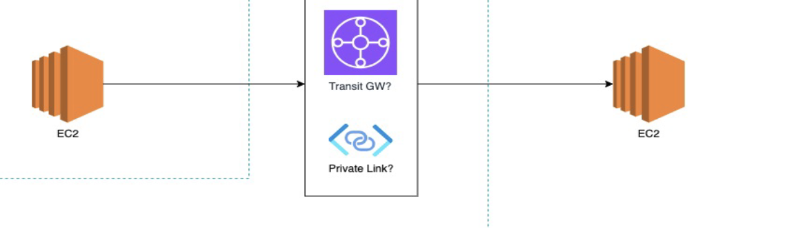

# AWS VPC PrivateLink Connection

A Terraform project that establishes secure communication between Provider and Consumer VPCs using AWS PrivateLink.

## Architecture Overview



## Key Components

### 1. VPCs and Networking
- **Provider VPC** (10.0.0.0/16)
  - 2 private subnets
  - Network Load Balancer
  - Provider EC2 instance (running HTTP server)

- **Consumer VPC** (10.1.0.0/16)
  - 1 public subnet (for bastion host)
  - 1 private subnet (for consumer instance)
  - Internet Gateway
  - VPC Endpoint

### 2. Security
- Private communication via AWS PrivateLink
- Bastion host for secure SSH access
- Isolated provider instance (no public access)
- Defined security groups for each component

### 3. Access Flow
```
Internet → Bastion Host → Consumer Instance → VPC Endpoint → NLB → Provider Instance
```

## Quick Start

1. **Prerequisites**
   - AWS CLI configured
   - Terraform installed
   - SSH key pair named "aleksey-pv" in AWS

2. **Deploy**
   ```bash
   terraform init
   terraform plan
   terraform apply
   ```

3. **Access**
   ```bash
   # SSH to bastion host
   ssh -i <ssh-key-name>.pem ec2-user@<bastion-public-ip>

   # From bastion, SSH to consumer instance
   ssh -i <ssh-key-name>.pem ec2-user@<consumer-private-ip>

   # Test connection to provider
   curl vpce-xxx.vpce-svc-xxx.region.vpce.amazonaws.com
   ```

## Project Structure

```
.
├── vpc_service_provider.tf    # Provider VPC configuration
├── vpc_service_consumer.tf    # Consumer VPC configuration
├── network_load_balancer.tf   # NLB setup
├── endpoint_provider.tf       # VPC Endpoint Service
├── endpoint_consumer.tf       # VPC Endpoint
├── ec2_instances.tf          # EC2 instances
├── security_groups.tf        # Security group rules
├── variables.tf              # Variable definitions
└── outputs.tf               # Output values
```

## Variables

| Name | Description | Default |
|------|-------------|---------|
| region | AWS Region | us-west-2 |
| provider_vpc_cidr | Provider VPC CIDR | 10.0.0.0/16 |
| consumer_vpc_cidr | Consumer VPC CIDR | 10.1.0.0/16 |
| instance_type | EC2 instance type | t3.micro |

## Testing

From the consumer instance, you should receive "Hello, World!" when curling the endpoint:
```bash
curl vpce-xxx.vpce-svc-xxx.region.vpce.amazonaws.com
```

## Security Notes
- Provider instance is only accessible through PrivateLink
- All private subnets have no direct internet access
- Bastion host is the only instance with a public IP
- Security groups follow least privilege principle

